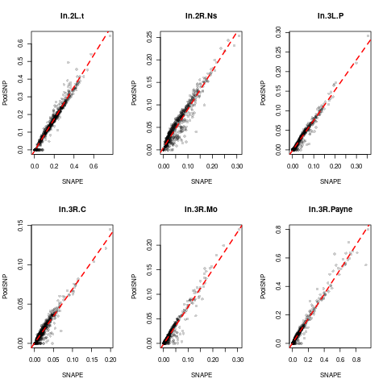
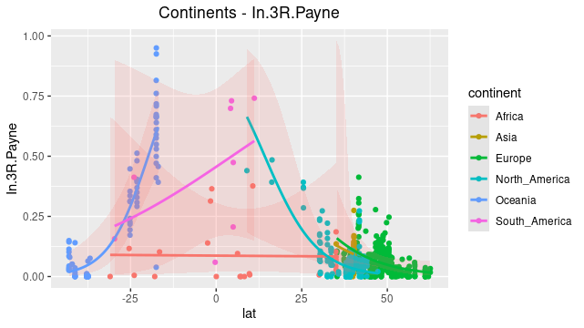
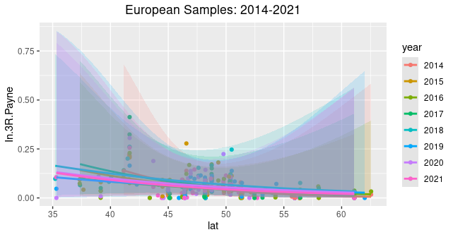

# Analysis of Inversion Specific Markers in the DESTv2 dataset.

The included scripts were applied to the *PoolSNP* and *SNAPE* VCF files of the DESTv2 project (https://dest.bio/), the filtered markers correspond with *inversion_markers_v6.txt*.
Average fequencies of these inversion specific marker SNPs were determined for each SNP calling method.

The calculated inversion frequencies for SNAPE can be found [here](results/SNAPE_nhm_inversion.af) and the results for PoolSNP [here](results/PoolSNP_nhm_inversion.af). 

The following Analyses were performed:

### Method Correlation
Correlation of average frequencies for both methods were investigated for correlation.

 

### Latitudinal Clines Across Continents 
For inverions *In(3R)Payne*, *In(2L)t*, *In(2R)Ns*, *In(3R)C*, *In(3R)K*, *In(3R)Mo* and  *In(3L)P* several analysis of relationship between latitude and inversion frequencies were performed. 

Preliminary result for In(3R)Payne from the PoolSNP dataset:

 

[Statistic Analysis on Latitudinal Clines](#statistics)

### Consistency Across Years
Investigations were performed on North American sampels and European samples, to get insight into consistency of allele frequencies across years.  

Preliminary result for Europe (PoolSNP dataset):

## Workflow

### Requirements

Make sure to have the following requirements installed and running:
- Python3
- R 
- GNU parallel (https://www.gnu.org/software/parallel/)

### Steps

Individual scripts to perform these analyses can be found in the scripts directory, the whole workflow including commands to call these scripts is documentated in the [main.sh](shell/main.sh) file.
Please note that this is not a fully automated pipeline, consequently paths and directories for intermediate files and results need to be created and changed during this analysis manually.
Additionally, scripts need to be called individually for SNAPE and PoolSNP data sets.

0) Download DEST data (http://berglandlab.uvadcos.io)
1) Convert VCF to SYNC
2) Get count at inversion specific marker SNPs
3) Calculate average frequencies for marker SNPs
4) Plot correlation of inversion markers present in PoolSNP & SNAPE 
5) Plot marker frequencies for each inversion occuring in the data set

### Statistics 

Type3 ANOVA was performed for latitudinal cline effects for all inversions with the "car" RPackage on the PoolSNP data set.
The summary for the ANOVA can be found [here](results/AdditionalStatistics/InversionStats.pdf).

### Additional scrips that can be used to extend analysis based on coverage

- Get the **average coverage** of all markers for each population as one vector in a CSV. [SubsampleSyncCov](scripts/SubsampleSyncCov.py)
- Get the **total coverage** of each marker across all populations as one vector in a CSV. [CovPerMarker](scripts/CovPerMarker.py)
